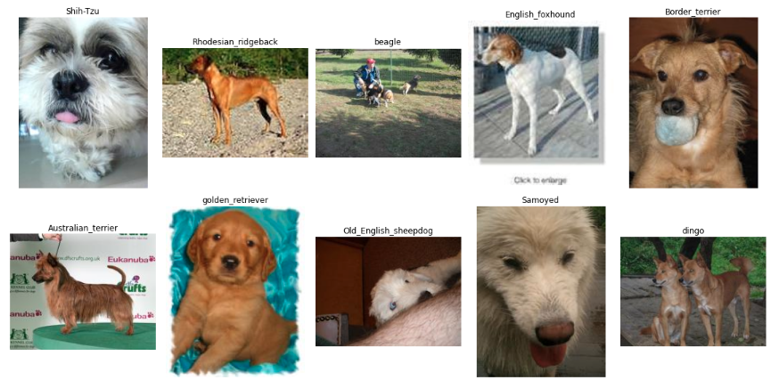
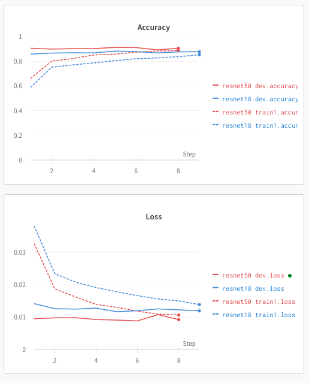
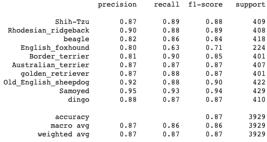
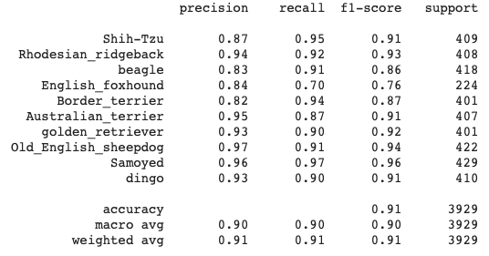
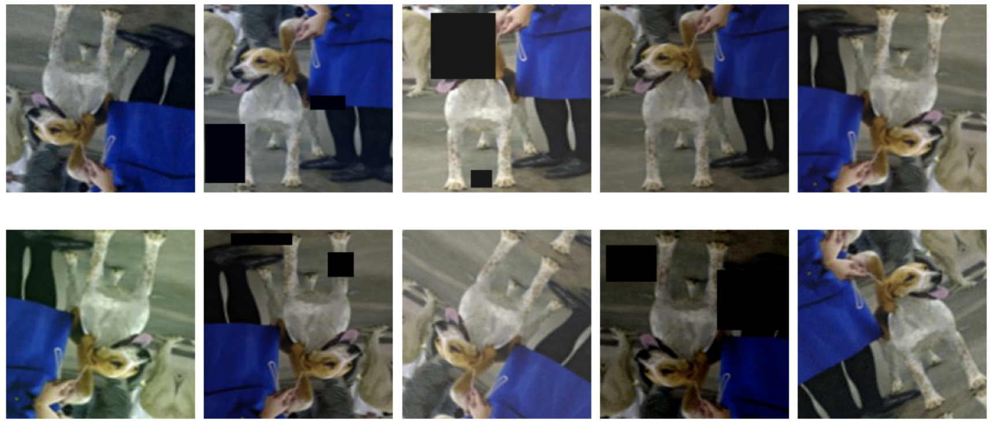
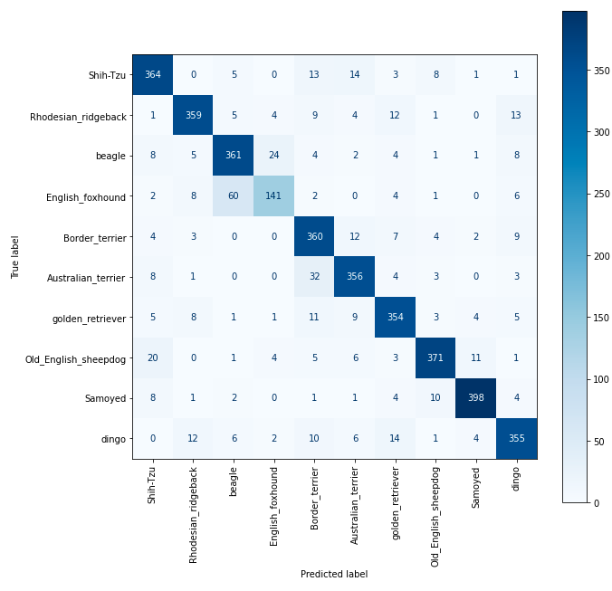
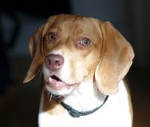
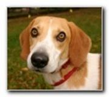

## Dog breed classification

<details>
  <summary>EDA</summary>


* [Colab](https://colab.research.google.com/drive/1dZi19we1l71v7I2gcR8Kb4KS5wfEN-pU?usp=sharing)

</details>
<details>
  <summary>Training</summary>


* [Colab](https://colab.research.google.com/drive/19t7Z1DF7v0_HXelcu3mFrwxC5pvRTR-2?usp=sharing)

**Environment:**
```bash
https://github.com/adeshkin/classification_dogs.git 
cd classification_dogs
python3 -m venv ./venv
source venv/bin/activate
pip install -r scripts/requirements.txt
```

**Data preparation:**
```bash
cd data
bash download_data.sh
python3 prepare_data.py
```

**Training:**
```bash
cd scripts
python3 train.py /path/to/config
```
</details>
<details>
  <summary>Telegram bot</summary>

* [Telegram bot](bot/README.md)
</details>
<details>
  <summary>Flask app</summary>

* [Flask app](flask/README.md)
</details>

### Dataset: 
  * [Imagewoof](https://github.com/fastai/imagenette#imagewoof)
> Imagewoof is a subset of 10 classes from Imagenet that aren't so easy to classify, since they're all dog breeds. The breeds are: Australian terrier, Border terrier, Samoyed, Beagle, Shih-Tzu, English foxhound, Rhodesian ridgeback, Dingo, Golden retriever, Old English sheepdog. 

<details>
  <summary>Data layout</summary>

```
imagewoof2-160
    train
        n02086240
            ILSVRC2012_val_00000907.JPEG
            ...
        ...
        n02115641
    val
        n02086240
            ILSVRC2012_val_00002701.JPEG
            ...
        ...
        n02115641
```
</details>





### Experimental results:

| Model        | Test accuracy | Size    | Training time (Tesla K80) |
|--------------|:-------------:|---------|:-------------------------:|
| **Resnet18** |     87 %      | 42.7 MB |          22 min           |
| **Resnet50** |     91 %      | 90.1 MB |          31 min           |

<details>
  <summary>Train logs</summary>




</details>

<details>
  <summary>Classification reports</summary>

**Resnet18:**



**Resnet50:**



</details>

<details>
  <summary>Parameters</summary>

**data**: imagewoof2-160

**split**: 
* train: train1 - 80%, dev - 20 %
* test: val - 100%  

**# classes**: 10, **batch size**: 32,  **# epochs**: 20

**lr_scheduler.StepLR**: 
* step_size=10
* gamma=0.1

**Augmentations**: Resize(height=160, width=160), ShiftScaleRotate, HorizontalFlip, VerticalFlip, 
CoarseDropout, GaussNoise, RGBShift, RandomBrightnessContrast

<details>
  <summary>example</summary>



</details>

</details>

**Confusion matrix (Resnet18)**



**According to confusion matrix there are many mistakes between beagle and English_foxhound:**

|                  beagle                  |             English_foxhound             |
|:----------------------------------------:|:----------------------------------------:|
|            |  |
|               beagle : 99%               | English_foxhound : 97% <br/>beagle : 2 % |

*Here model distinguishes beagle and English_foxhound

### Conclusions:
* Finetuning models is good baseline 
* It is really difficult to classify such images (people with dogs, puppies, ...)
* Custom model with several conv layers are not suitable here
* According to per-class metrics we see that models can't distinguish beagle and English_foxhound in some cases 


### Future work:
* Experiments with different augmentations and sota models
* Converting and optimizing pytorch models for mobile deployment

