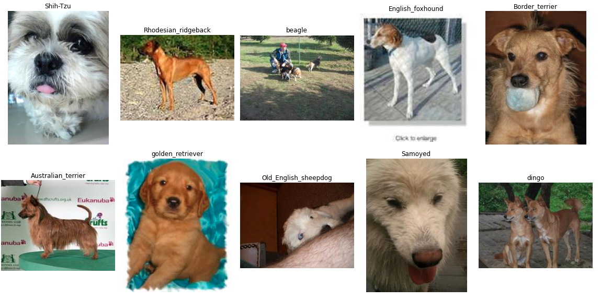
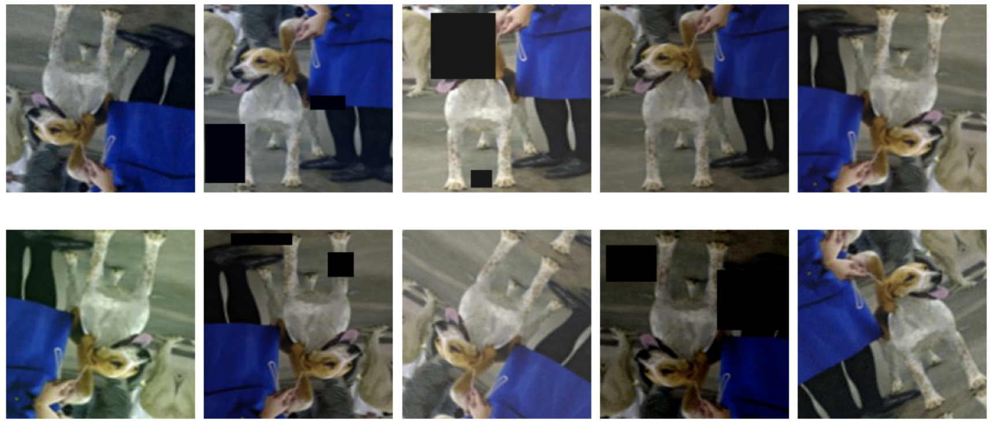

## Dog breed classification

<details>
  <summary>Training</summary>

* [Example on colab](https://colab.research.google.com/drive/1tP1FnphFP3IviG3pqhoi5pBFvp5gPhy8?usp=sharing)

**Environment:**
```bash
https://github.com/adeshkin/classification_dogs.git 
cd classification_dogs
python3 -m venv ./venv
source venv/bin/activate
pip install -r scripts/requirements.txt
```

**Data preparation:**
```bash
cd data
bash download_data.sh
python3 prepare_data.py
```

**Training:**
```bash
cd scripts
python3 train.py /path/to/config
```
</details>
<details>
  <summary>Telegram bot</summary>

* [Telegram bot](bot/README.md)
</details>
<details>
  <summary>Flask app</summary>

* [Flask app](flask/README.md)
</details>

### Dataset: 
  * [Imagewoof](https://github.com/fastai/imagenette#imagewoof)
> Imagewoof is a subset of 10 classes from Imagenet that aren't so easy to classify, since they're all dog breeds. The breeds are: Australian terrier, Border terrier, Samoyed, Beagle, Shih-Tzu, English foxhound, Rhodesian ridgeback, Dingo, Golden retriever, Old English sheepdog. 





### Experimental results:

|              | Accuracy | Size    | Training time, Tesla K80 |
|--------------|----------|---------|--------------------------|
| **Resnet18** | 99.85    | 44.8 MB | 42 mins                  |
| **Resnet50** | 97.72    | 9.2 MB  | 32 mins                  |

**data**: imagewoof2-160

**# classes**: 10, **batch size**: 32,  **# epochs**: 20

**lr_scheduler.StepLR**:  (step_size=10, gamma=0.1)

**Augmentations**: Resize(height=160, width=160), ShiftScaleRotate, HorizontalFlip, VerticalFlip, 
CoarseDropout, GaussNoise, RGBShift, RandomBrightnessContrast

<details>
  <summary>example</summary>



</details>


